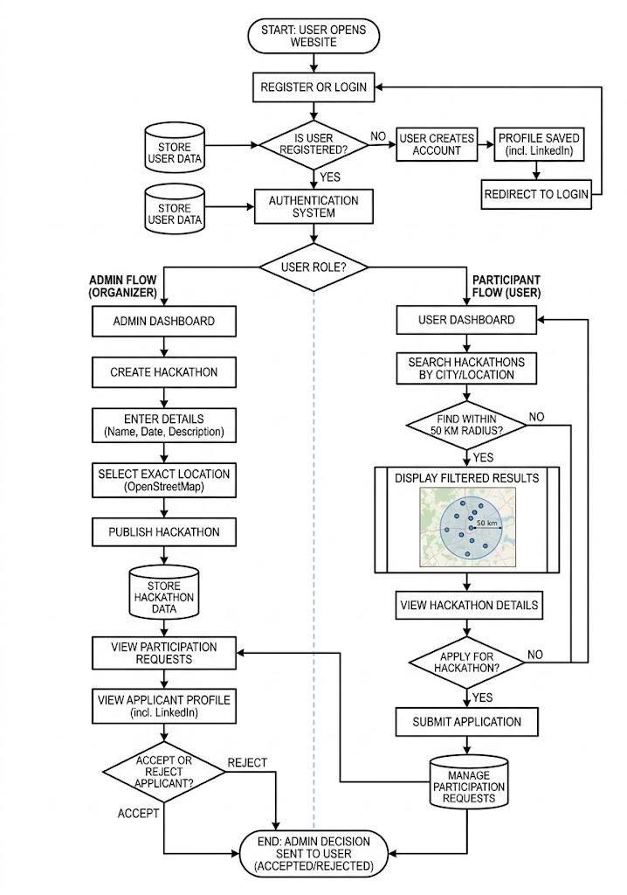

# Hackathon Discovery and Registration Web Application

## Overview

The **Hackathon Discovery and Registration Web Application** is a centralized, web-based platform designed to streamline the process of organizing, discovering, and participating in hackathons. In recent years, hackathons have emerged as an important medium for innovation, collaboration, and skill development. However, information about such events is often scattered. This project bridges the gap by providing a central interface tailored for both **participants** and **organizers (admins)**.

### Abstract 
The application leverages HTML, CSS, JavaScript, and PHP. It provides a unique location-based search using OpenStreetMap API that enables users to find hackathons strictly in their nearby areas (50 km radius) by simply entering their city. Participants can apply for hackathons seamlessly and present their linked-in integrated profile for admins to review and accept/reject. 

---

## Technical Stack
- **Frontend Technologies:** HTML, CSS, JavaScript
- **Backend Technology:** PHP
- **Database:** MySQL
- **APIs Used:** OpenStreetMap API (Location search and mapping)

---

## Features & System Modules

### 1. User Management (Authentication & Profile)
Allows users and administrators to securely register, login, and maintain their profiles. 
- Integrated LinkedIn profiling so organizers can quickly vet candidates.

### 2. Homepage & Dashboard
After logging in, users are directed to the dashboard where they can access event details. 

### 3. Location-Based Search & Discovery Module
Uses the OpenStreetMap API. The system filters events within a 50 km radius, helping users pinpoint nearby hackathons easily and efficiently.

### 4. Admin Management (Event Creation)
Administrators can create hackathons, embed exact location coordinates on the map, list prerequisites, and specify dates.

*(Note: Refer to actual images for admin creation page)*

### 5. Participation Request Module
Once a user applies for a hackathon, their request goes directly to the Admin. The Admin reviews the profile (and LinkedIn) and issues an Accept/Reject.

### 6. Team Matchmaking / Finder
Users have the ability to seek teammates within the platform.

### 7. Communication System
Built-in emailing / messaging interface for quick communication between admins and users.

---

## Objectives

1. **Centralize Hackathon Data:** Stop relying on fragmented communication channels by bringing organizers and participants into one platform.
2. **Location Awareness:** Enable local talent discovery by making events searchable by an exact 50 km radius.
3. **End-to-End Tracking:** Track user applications and status notifications.

---

## Development Team
- **Vedant**
- **Archit**

---

## System Requirements
To run this project locally, ensure you have:
- PHP (v7.4 or newer recommended)
- MySQL Server
- XAMPP / WAMP / MAMP stack
- A web browser (Chrome, Firefox, Safari)

## Installation Guide
1. **Clone the repository.**
2. **Set up Local Server**: Move the project folder to `htdocs` (if using XAMPP).
3. **Database Import**: Create a new database in phpMyAdmin and import the `.sql` files from the `sql/` directory.
4. **Update config**: Verify `includes/db_connect.php` has your proper MySQL username/password credentials.
5. **Run the Project**: Open `http://localhost/WP-class/` in your browser.

---

## Conclusion
This Web Application provides a practical and efficient solution to the problem of hackathon visibility and accessibility. By combining modern web technologies, it acts as a bridge between individuals seeking opportunities and those creating them. 
