# 🚀 DevSprint - Find Nearby Hackathons

<p align="center">
  
  
  
  
  
</p>

---

## 📌 Overview

The Hackathon Discovery & Registration Web Application is a centralized platform designed to simplify the process of discovering, organizing, and participating in hackathons.

Hackathon information is often scattered across different platforms, making it difficult for participants to find relevant opportunities. This project solves that problem by providing a single, user-friendly interface for both participants and organizers.

---

## 🧠 Abstract

This web application allows users to search and apply for hackathons based on their location using the OpenStreetMap API.

📍 Users can:
- Discover hackathons within a 50 km radius  
- Apply using a LinkedIn/Github integrated profile  
- Track application status
- Communicate with Team Members
- Create / Manage Teams
- Local Team Group Chat
- Find Team-Mates
- Join existing teams

🧑‍💼 Admins can:
- Create and manage hackathons  
- Review applications  
- Accept / Reject participants and teams
- Respond User Queries / Feedbacks 

The system acts as a bridge between opportunity seekers and event organizers, improving accessibility and participation.

---

## ✨ Features

🔐 Authentication System  
- Secure Login & Registration  
- User Profile Management  
- LinkedIn/Github Profile Integration  

📍 Location-Based Discovery  
- Map-based hackathon search  
- 50 km radius filtering  
- Real-time location visualization  

🧑‍💼 Admin Dashboard  
- Create/Edit/Delete Hackathons  
- Add event details & location  
- Manage participant requests  

📩 Participation System  
- Apply for hackathons  
- Admin approval workflow  
- Notification system  

🤝 Team Matchmaking  
- Find teammates  
- Join/Create teams  

💬 Communication  
- Built-in messaging/email system  

---

## 🛠️ Tech Stack

| Category | Technology |
|----------|------------|
| Frontend | HTML, CSS, JavaScript |
| Backend  | PHP |
| Database | MySQL |
| API | OpenStreetMap, Github |
| Server | Apache (XAMPP) |

---

## 🏗️ System Architecture

<p align="center">
  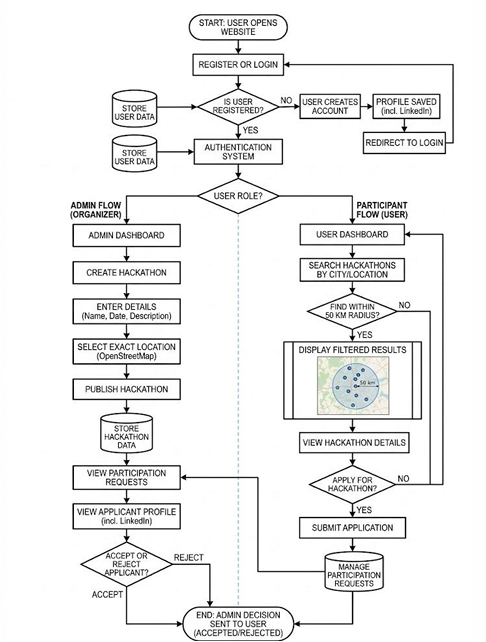
</p>

---

## 🔄 Modules

- User Management  
- Admin Management  
- Hackathon Management  
- Location-Based Search  
- Participation Requests  
- Database Management  

---

## 📸 Output

### 🧑‍💻 User Side Interface

#### 🏠 Home Dashboard
<p align="center">
  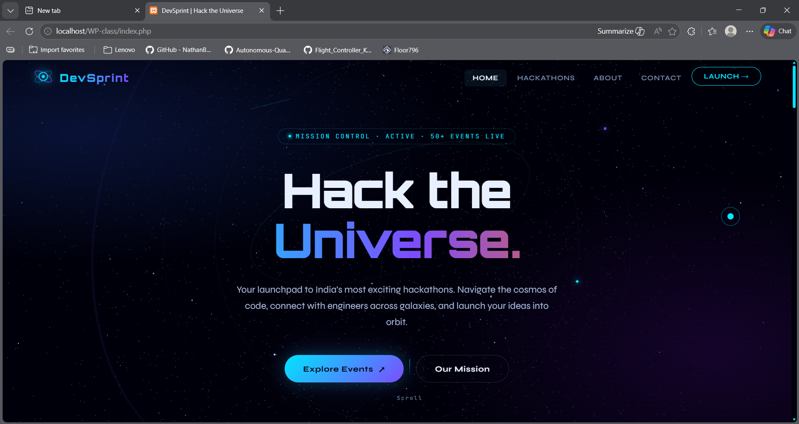
</p>

#### 🔐 Login / Registration
<p align="center">
  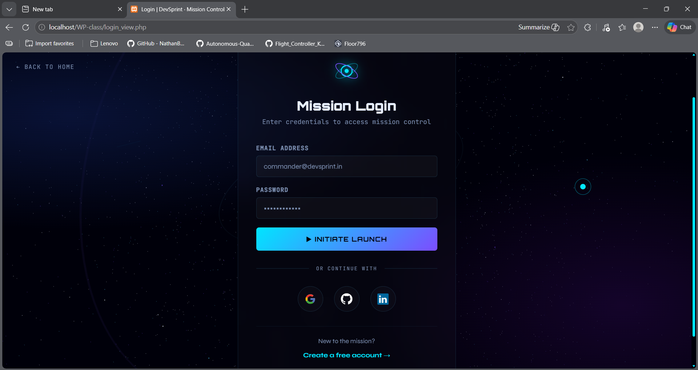
</p>

#### 🎯 Hackathons Page
<p align="center">
  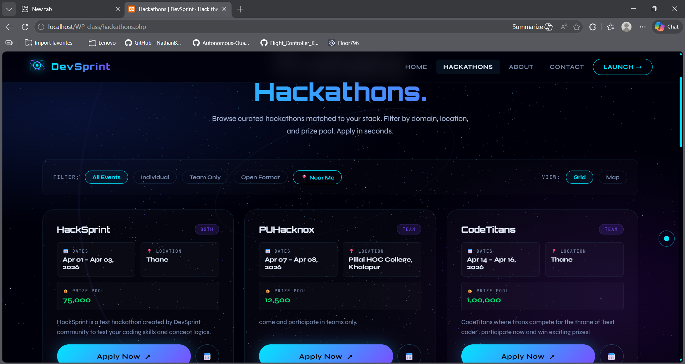
</p>
<p align="center">
  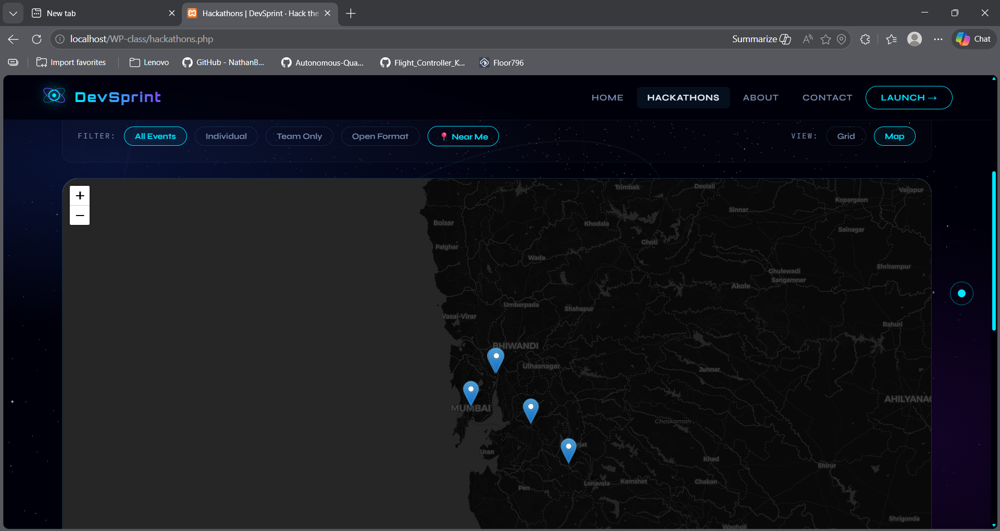
</p>

#### 👤 Profile Page
<p align="center">
  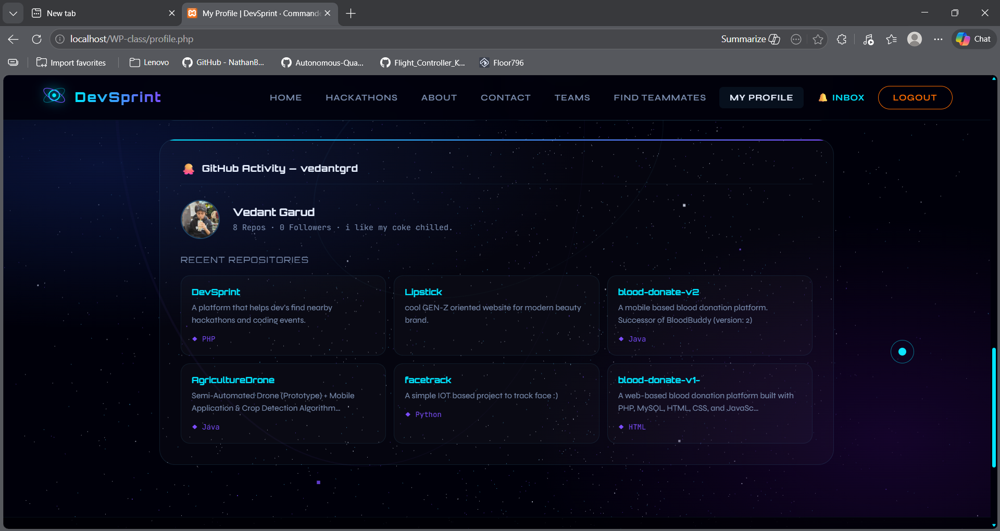
</p>

#### 🤝 Find Teammate
<p align="center">
  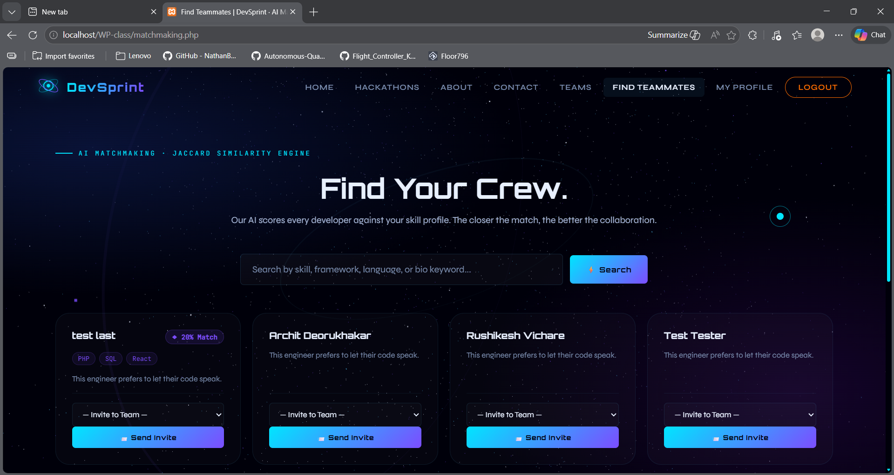
</p>

#### 👥 My Team
<p align="center">
  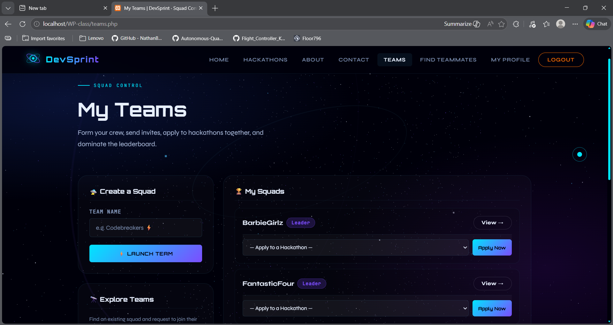
</p>

#### 📩 Inbox / Messages
<p align="center">
  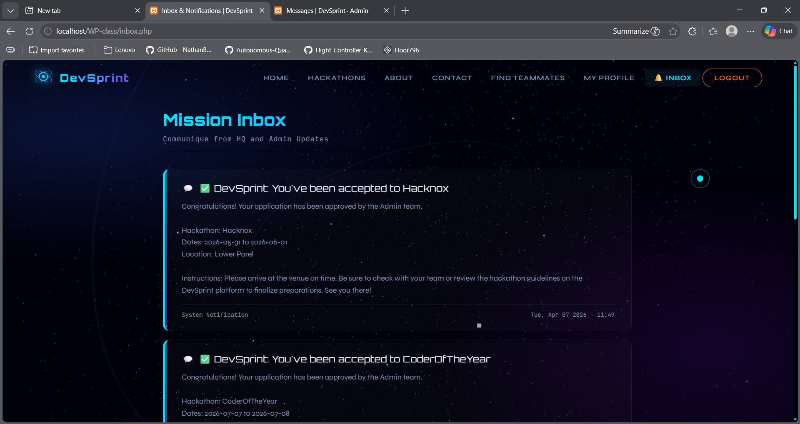
</p>
<p align="center">
  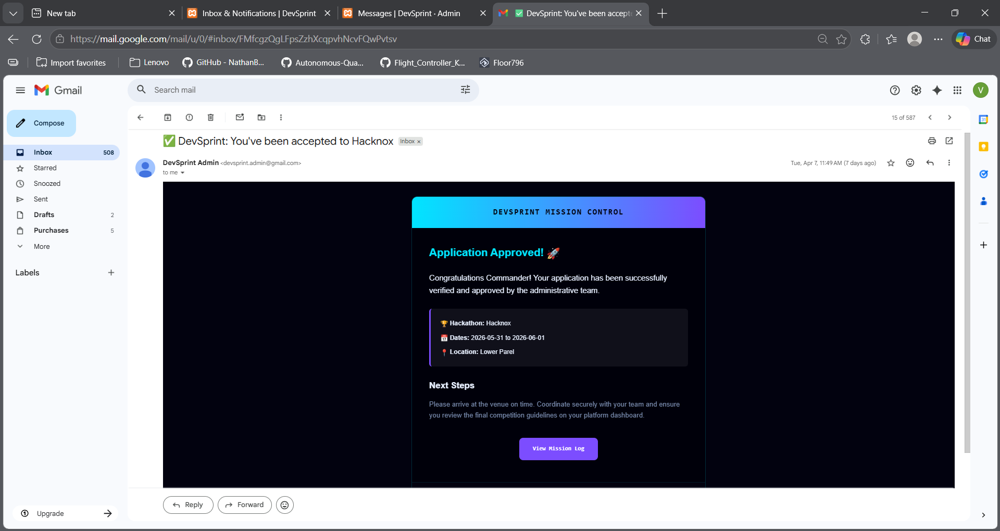
</p>

#### ℹ️ About Page
<p align="center">
  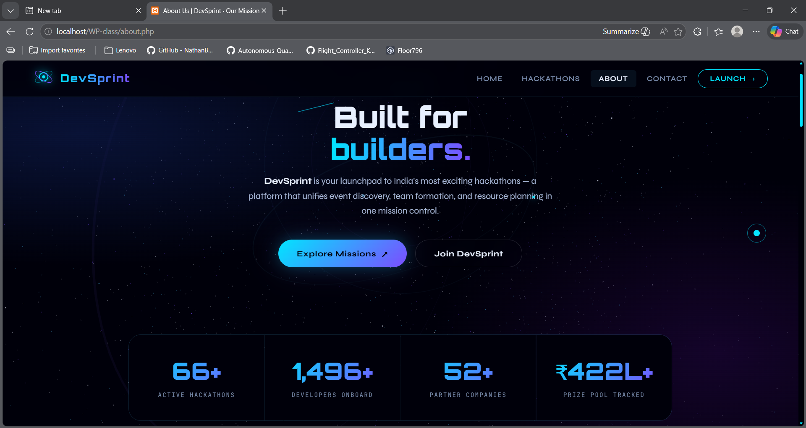
</p>

#### 📞 Contact Page
<p align="center">
  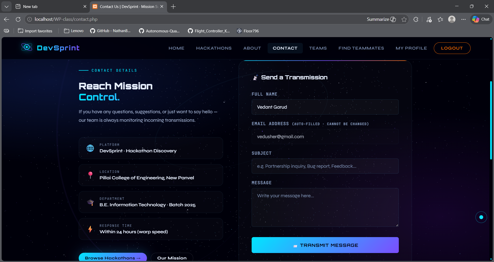
</p>

---

### 🧑‍💼 Admin Side Interface

#### 📊 Admin Dashboard
<p align="center">
  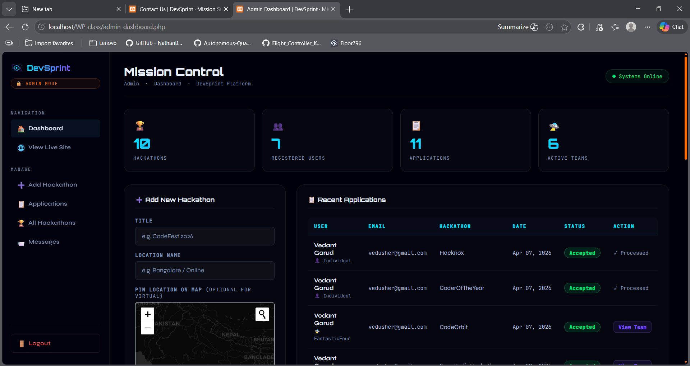
</p>
<p align="center">
  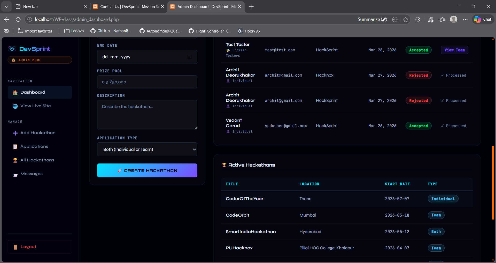
</p>

#### 💬 Admin Messages Panel
<p align="center">
  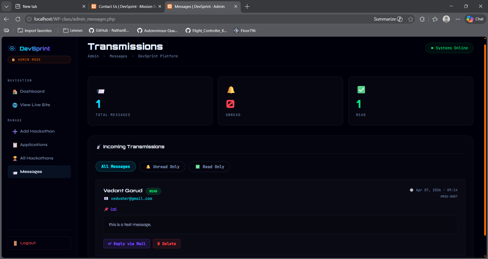
</p>

---

## 🎯 Objectives

- Centralize hackathon information  
- Enable location-based discovery  
- Simplify participation process  
- Improve organizer reach  

---


## 🚀 Installation Guide

```bash
git clone https://github.com/kryyo1441/WP-class

# Move project to htdocs

# Setup Database:
- Open phpMyAdmin  
- Create new database  
- Import .sql file  

# Configure Database:
- Update includes/db_connect.php  

# Run Project:
http://localhost/WP-class/
```

---

## 👨‍💻 Team

| Name | Roll No |
|------|--------|
| Rushikesh Shekhar Vichare | 461 |
| Vedant Nitin Garud | 462 |
| Aayush Narayan Nair | 463 |
| Archit Mangesh Deorukhakar | 464 |

---

## 📊 Results

- Successfully implemented all modules  
- Smooth user & admin workflow  
- Efficient location-based filtering  
- Clean and responsive UI  

---

## 🏁 Conclusion

This project provides a scalable and efficient solution for hackathon discovery and management.

It enhances:
- Accessibility  
- User experience  
- Event visibility  

---

## 🔮 Future Scope

- Mobile App Integration  
- AI-based Recommendations  
- Advanced Filters  
